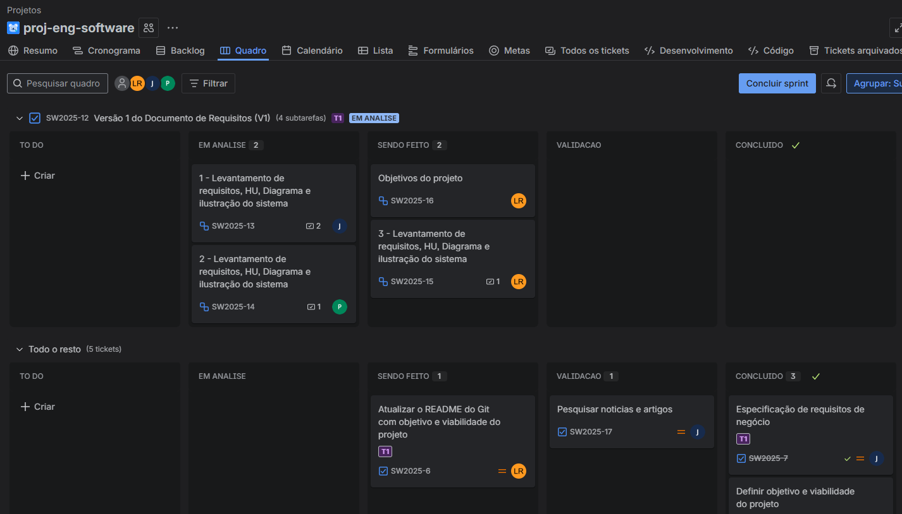
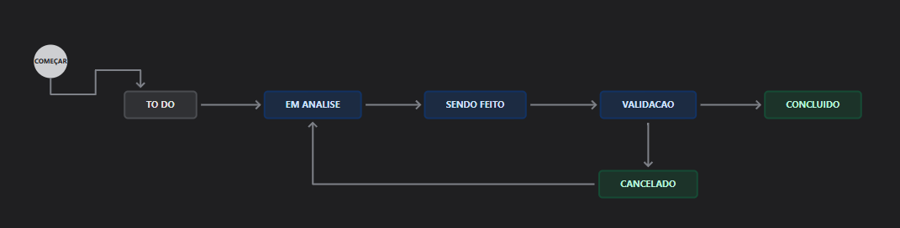
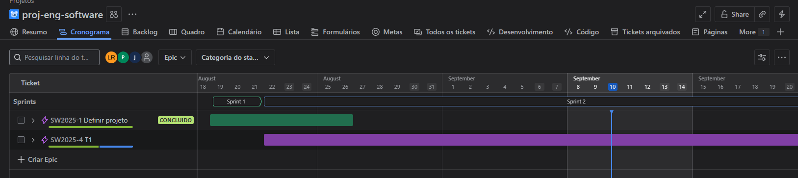

# proj-eng-software

## Introdução

No ambiente escolar, muitos docentes ainda enfrentam dificuldades relacionadas à organização de informações, à comunicação eficiente e ao acesso centralizado de dados importantes para o desenvolvimento de suas práticas pedagógicas. Esses desafios acabam gerando sobrecarga de tarefas, perda de tempo e limitações no acompanhamento adequado do processo de ensino.

A partir dessa realidade, identificou-se a necessidade de uma aplicação que apoie diretamente o corpo docente, oferecendo recursos que tornem suas rotinas mais ágeis, práticas e integradas.

## Objetivos

Temos como objetivo neste projeto desenvolver um sistema voltado para escolas do Ensino Fundamental I para auxiliar no planejamento de aulas e no desenvolvimento de tarefas, priorizando as demandas de professores e professoras em suas atividades cotidianas. O sistema proposto busca atender às principais necessidades relatadas pelos usuários, apresentando-se como uma solução capaz de otimizar processos, reduzir esforços repetitivos e contribuir para a qualidade da experiência educacional.

## Levantamento dos Requisitos

### Entrevista

Para a etapa inicial de levantamento de requisitos, optou-se pela realização de entrevistas semiestruturadas, a fim de compreender melhor suas necessidades, dificuldades e expectativas em relação ao uso da tecnologia no contexto escolar. O roteiro adotado foi composto por perguntas abertas, permitindo maior liberdade de resposta e a possibilidade de explorar pontos adicionais conforme o diálogo evoluía.

```
1. Você faz uso da tecnologia no seu dia a dia escolar? Se sim, quais ferramentas ou sistemas já fazem parte da sua rotina?
2. Quais principais dificuldades ou problemas você enfrenta em relação ao processo educacional (organização, comunicação, planejamento, acompanhamento dos alunos, etc.)?
3. Você acredita que a tecnologia poderia contribuir para a resolução desses problemas? Se sim, de que forma?
4. Se existisse um sistema que ajudasse a lidar com essas dificuldades, você estaria disposto(a) a utilizá-lo?
5. Na sua visão, as dificuldades de alguns professores em lidar com a tecnologia poderiam ser uma barreira para a adoção do nosso projeto?
6. Como você organiza atualmente o planejamento das aulas e o acompanhamento das atividades dos alunos?
7. Que funcionalidades ou recursos você considera indispensáveis em um sistema desse tipo? Poderia detalhar?
8. Você gostaria que o sistema tivesse funcionalidades voltadas também para a comunicação com os responsáveis (pais e responsáveis legais)?
```

A entrevista foi realizada de forma online, via WhatsApp, e as respostas foram registradas em anotações, possibilitando posteriormente a análise e categorização das informações.

### Análise das Respostas

Respostas da primeira entrevistada:

1. "Registro de classe online (RCO)"
2. "Planejamento, acompanhamento dos alunos"
3. "Sim, por exemplo no acompanhamento dos alunos, por ser muito conteúdo a ser trabalhado de uma vez muitos deles acabam não aprendendo e ficando para traz, vejo que se tivesse menos conteúdos poderia ajudar"
4. "Sim"
5. "Com toda certeza"
6. "Planejamento em casa e a maior parte das atividades para ver se eles tiverem um conhecimento sobre e aplicado uma prova"
7. As funcionalidades relatadas pela professora serão abordadas na seção de [Histórias de Usuário](#Historias-de-Usuario).
8. "Sim". Uma das funcionalidades sugeridas pela professora será abordada na seção de [Histórias de Usuário](#Historias-de-Usuario).

A professora também sugeriu a criação de um formulario para facilitar a coleta dos requisitos e atingir um público maior.

Resposta da segunda entrevistada:

1. "Sim, lousa digital, sistema RCO pra chamada, e ferramentas do Google como Drive e Docs."
2. Não foi capaz de responder, nenhum problema específico.
3. "⁠Planejamento poderia ser como se fosse um programa pra fazer planejamento e nesse mesmo programa vamos supor, se fosse a prefeitura, se eu colocasse a página 30 da apostila ele já me desse os objetivos pra eu trabalhar."
4. "Eu sim."
5. "Sim, tem professor que desistiu de dar aula na pandemia, deixou de entregar pq não sabia usar computador na pandemia."
6. "Papel, caderno, faz no computador imprime e põe numa pasta, e as salas não tem computador de professor teria que levar o dela, e a internet na escola é péssima."
7. Resposta na seção de [Histórias de Usuário](#Historias-de-Usuario).
8. "Não de forma alguma."

### Pesquisa

Também foi feita uma pesquisa de artigos e publicações acadêmicas relacionadas ao uso de tecnologia na educação, com o intuito de identificar tendências, desafios e oportunidades nesse campo. O artigo utilizado como referência destaca que, no desenvolvimento de sistemas escolares para apoiar professores e facilitar o acompanhamento dos pais, é fundamental considerar o que José Moran discute em [**Gestão inovadora da escola com tecnologias**](https://moran.eca.usp.br/textos/tecnologias_eduacacao/gestao.pdf).

Segundo o autor, tecnologia na escola vai além do uso de computadores e internet, abrangendo também materiais, metodologias de ensino e a própria organização do espaço escolar, todos voltados para potencializar a aprendizagem (MORAN, 2000). Dessa forma, o sistema proposto deve ser entendido como uma ferramenta integradora, capaz de unir aspectos administrativos e pedagógicos, oferecendo funcionalidades como cadastro de alunos, planejamento de aulas e comunicação eficiente entre professores e responsáveis, alinhando-se às necessidades identificadas nas entrevistas realizadas.

## Historias de Usuario

## Plano de Gerenciamento de Requisitos

Visando garantir que todos os requisitos identificados sejam devidamente documentados, rastreados e gerenciados ao longo do ciclo de vida do projeto, foram criados um repositório no GitHub e um quadro no Jira, para melhor visualização das atividades realizadas e um histórico de mudanças. Esses recursos permitem a organização eficiente das informações, facilitando o acompanhamento do progresso e a comunicação entre os membros da equipe.

Para o GitHub, o foco na documentação foi utilizando arquivos Markdown, suas edições foram feitas em partes conforme desenvolvimento do projeto para manter o controle de versões, facilitando na busca do historico e de mudanças feitas. Além disso esse repositório também será utilizado para armazenar o código-fonte do sistema, garantindo que todas as alterações sejam registradas e possam ser revertidas se necessário.

Quanto ao Jira, foram configurados três abas principais: Backlog, Quadro e Cronograma. O Backlog foi utilizado para criação das tarefas visualização de todas as atividades pendentes e criadas. O Quadro, por sua vez, foi configurado para acompanhar o progresso das tarefas, permitindo a visualização do status de cada atividade (a fazer, em andamento, concluído). Já o Cronograma foi utilizado para planejamento e monitoramento dos prazos, garantindo que todas as etapas do projeto sejam cumpridas dentro do tempo estipulado.

Dando mais detalhes no Quadro, foram criadas colunas específicas para cada etapa do desenvolvimento, como "To Do" (A fazer), "Em Análise", "Sendo feito", "Validação" e "Concluído".



As tarefas foram quebradas em partes, ou seja, uma tarefa maior principal foi dividida em várias subtarefas menores, para facilitar o acompanhamento e a execução.

O fluxo de trabalho foi visualmente representado no quadro, tarefas em analise tinham como objetivo serem revisadas e avaliadas antes de serem iniciadas, garantindo que todos os requisitos fossem compreendidos e alinhados com os objetivos do projeto. As tarefas em andamento indicavam que estavam sendo ativamente trabalhadas, enquanto as tarefas em validação passavam por uma revisão final para assegurar a qualidade e conformidade com os requisitos estabelecidos. Também foi incluido um fluxo de "Cancelada" para tarefas que por algum motivo não seriam mais realizadas ou que precisavam ser reavaliadas.



Quanto a aba do Cronograma, ela foi desenvolvida de uma forma mais simples para o projeto, visando a entrega dos trabalhos propostos na disciplina com os prazos definidos e facilitando o uso pelos demais membros. Em um ambiente profissional, o cronograma seguiria uma abordagem mais detalhada e estruturada, visando diferentes entregas para um projeto maior, por exemplo, os "Epics" no Jira representam "Histórias de Usuário" ou requisitos do Produto que muitas vezes não abordam uma explicação mais detalhada da sua implementação, mas sim o que o usuário final espera do sistema.

Esses "Epics" são divididos em "Tarefas" menores, que representam atividades específicas necessárias para completar o "Epic". Essas tarefas podem ser ainda subdivididas em "Subtarefas", que são ações mais granulares e detalhadas, facilitando o acompanhamento do progresso e a atribuição de responsabilidades. Além disso os "Epics" podem ser revisados e esclarecidos em reuniões de "Refinamento Técnico", onde a equipe discute os detalhes técnicos, prioridades e possíveis desafios relacionados à implementação.


