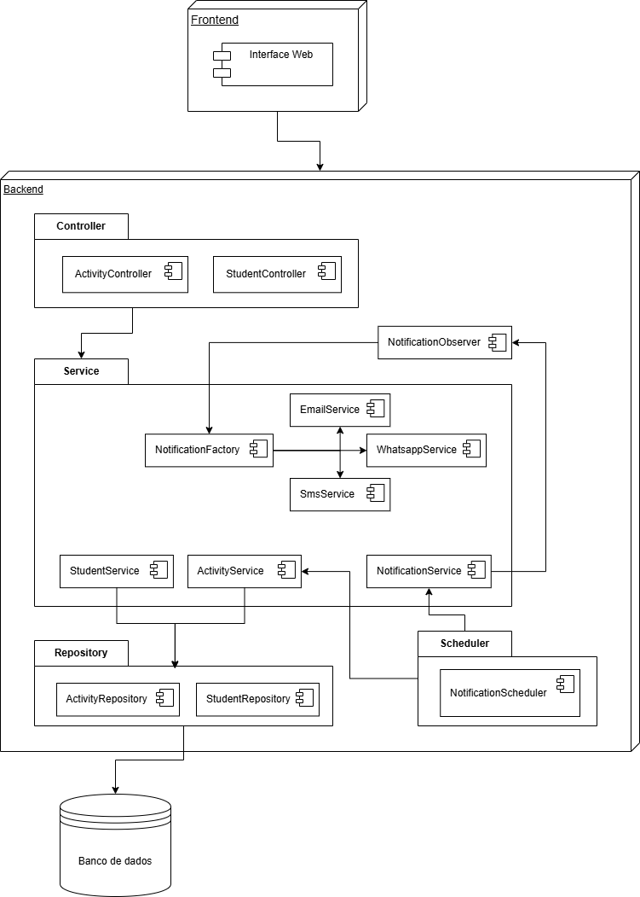

# Modelagem e Desenvolvimento

- [Gerência de Qualidade](#Gerência-de-Qualidade)
  - [Tecnologias e Ferramentas](#Tecnologias-e-Ferramentas)
  - [Regras e Padrões de Desenvolvimento](#Regras-e-Padrões-de-Desenvolvimento)
- [Arquitetura de Software](#Arquitetura-de-Software)
- [Padrões de Projeto](#Padrões-de-Projeto)
- [Como Executar o Projeto](./codigo/README.md)

## Gerência de Qualidade

Esta seção apresenta o plano de gerenciamento da qualidade do projeto, detalhando os processos e critérios que serão utilizados para garantir que as funcionalidades finais atendam aos padrões de qualidade estabelecidos. Será abordado as tecnologias e ferramentas que serão utilizadas além dos processos de verificação e validação que serão implementados ao longo do desenvolvimento do projeto.

### Tecnologias e Ferramentas

- Linguagens de Programação: Java, JavaScript
- Frameworks: Spring Boot (backend), para o frontend pode ser utilizado React (abordado na disciplina de Desenvolvimento Web).
- Banco de Dados: Para testes iniciais, pode ser utilizado o H2 (banco de dados em memória). Para o ambiente de produção, pode ser utilizado PostgreSQL ou MySQL.

### Regras e Padrões de Desenvolvimento

1. Controle de Versões: para manter um bom controle das funcionalidades e versões do projeto, recomenda-se as seguintes práticas:
   - Criação de branches para cada nova funcionalidade ou correção de bug com código relacionado à tarefa do Jira.
   - Realização de pull requests para revisão de código antes da integração a branch principal com pelo menos 1 aprovação de um revisor, o PR deve conter uma descrição clara do que foi desenvolvido nele e prints das telas ou funcionalidades implementadas evidenciando testes feitos.
   - Uso de mensagens de commit claras e descritivas (ex: "Implementa funcionalidade X").
   - Manter a branch principal sempre estável e funcional.
2. Padrões de Código: seguir boas práticas de codificação, como:
   - Nomes de variáveis e métodos em camelCase, nomes de classes em PascalCase, ambos devem ser descritivos e em inglês.
   - Para JavaScript, seguir as recomendações do ESLint e Prettier para manter a consistência do código.
   - Para Java, seguir as recomendações do Checkstyle para manter a consistência do código.
3. Testes: seguindo o esquema do Board do Jira, quando uma tarefa for aprovada e entrar na fase de "Validação", outros membros do time devem testar a funcionalidade implementada para garantir que ela funciona conforme o esperado.
4. Documentação: manter a documentação do projeto atualizada, incluindo:
   - Documentação do código (comentários claros e concisos).
   - Documentação das APIs (usando Swagger ou similar).
   - Atualização do README com instruções de configuração, execução e contribuição.

## Arquitetura de Software

A arquitetura do sistema será baseada em uma arquitetura em camadas (layered architecture), que separa as responsabilidades do sistema em diferentes níveis. Sua escolha se deve à sua simplicidade, facilidade de manutenção e escalabilidade, adequada para aplicações web com lógica de negócio intermediária e persistência de dados. Em caso de futuras expansões (como a inclusão de módulos de pais/responsáveis ou dashboards de desempenho), novas camadas ou serviços podem ser integrados sem impacto significativo nas demais partes do sistema.

Outro ponto determinante para essa escolha foi a compatibilidade natural da arquitetura em camadas com o framework Spring Boot, o qual já fornece mecanismos bem definidos para controladores, serviços e repositórios, facilitando a padronização do código e a divisão de tarefas entre os membros da equipe.

Estrutura em Camadas:

| Camada     | Responsabilidade                                                                               |
| ---------- | ---------------------------------------------------------------------------------------------- |
| Controller | Gerencia as requisições HTTP, interage com a camada de serviço e retorna respostas ao cliente. |
| Service    | Contém a lógica de negócio, processa dados e aplica regras de negócio.                         |
| Repository | Responsável pela interação com o banco de dados, realizando operações CRUD.                    |
| Model      | Define as entidades do sistema e suas relações.                                                |

### Diagrama de Arquitetura

## Padrões de Projeto

### Observer Pattern

O Observer Pattern foi adotado para a funcionalidade de notificações automáticas aos responsáveis pelos alunos quando uma atividade ou avaliação está próxima do prazo de entrega.

Essa implementação permite que o sistema seja facilmente expandido, adicionando novos tipos de notificações (como SMS e WhatsApp) sem alterar a lógica central. Isso garante baixo acoplamento, alta extensibilidade e reuso de código.

Classes envolvidas:

- `ActivityObserver.java`: Define o contrato que todo "observador" deve seguir. Qualquer classe que queira "ouvir" sobre atividades próximas do vencimento deve implementar esta interface.
- `ActivityNotificationService.java`: Classe que gerencia os observadores mantendo uma lista de todos os observadores registrados. Ela possui métodos para adicionar e notificar cada observador chamando o método da interface disparando as notificações.
- `ParentNotificationObserver.java`: Classe concreta que implementa a interface `ActivityObserver`, aplicando a lógica específica para enviar notificações e usando `NotificationServiceFactory.java` para obter o serviço de notificação adequado.

#### Diagrama

...

### Factory Method Pattern (Yoshida)

Explicação... Quem explica...

#### Diagrama

...

### Repository Pattern (Pedro)

Explicação... Quem explica...

#### Diagrama

...

### Outros Padrões

#### Scheduled Task Pattern

O Scheduled Task Pattern foca na execução automática de uma certa tarefa em intervalos regulares ou em horários específicos, sem a necessidade de intervenção manual. No contexto deste projeto, esse padrão foi implementado para gerenciar a verificação periódica de prazos de atividades e avaliações. Ele foi desenvolvido utilizando o Spring Scheduler, que permite agendar tarefas de forma simples e eficiente no arquivo `ActivityTaskScheduler.java` com a anotação `@Scheduled`.
