# Modelagem e Desenvolvimento

- [Cenarios de testes](#Cenarios-de-testes)
- [Testes automatizados](#Testes-automatizados)
- [Novas funcionalidades e refatorações](#Novas-funcionalidades-e-refatorações)
- [Demonstração](#Demonstração)
- [Como Executar o Projeto](../Trabalho2/codigo/README.md)

## Cenarios de testes

### Cenário 1: Atividades (Levorato)

- Testar a criação de atividades com diferentes tipos de dados (texto, números, datas).

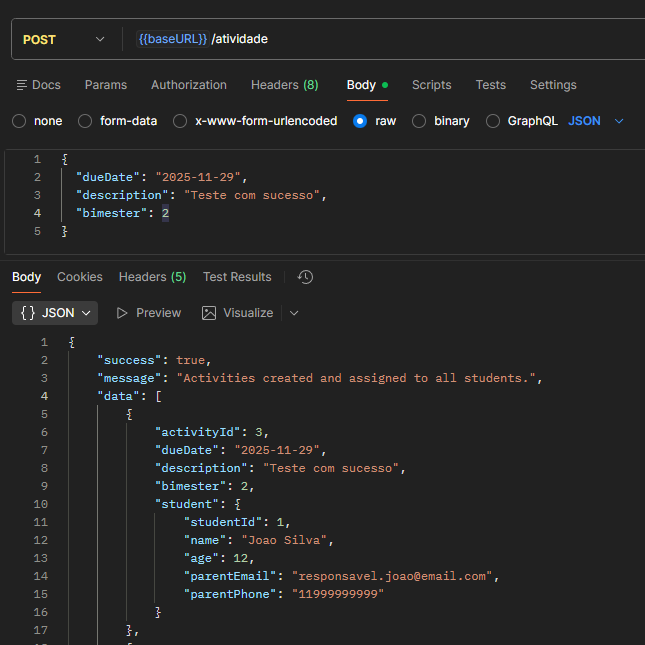

- Testar a criação de atividades com dados inválidos (ex: datas no formato errado, números negativos).

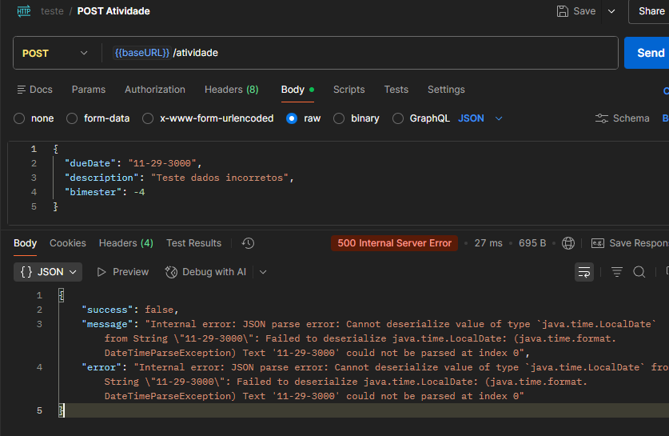

Teste 3 passou, será necessário corrigir este comportamento.
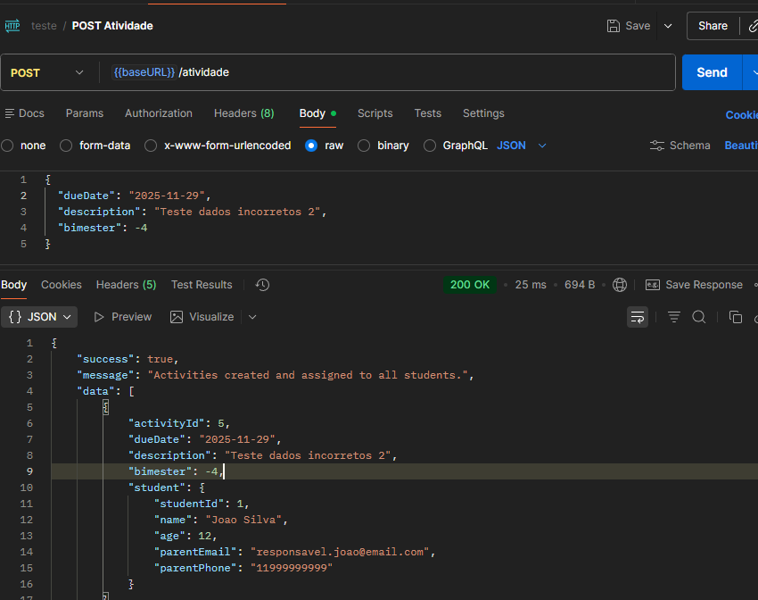

- Testar a criação de atividades com campos obrigatórios faltando.

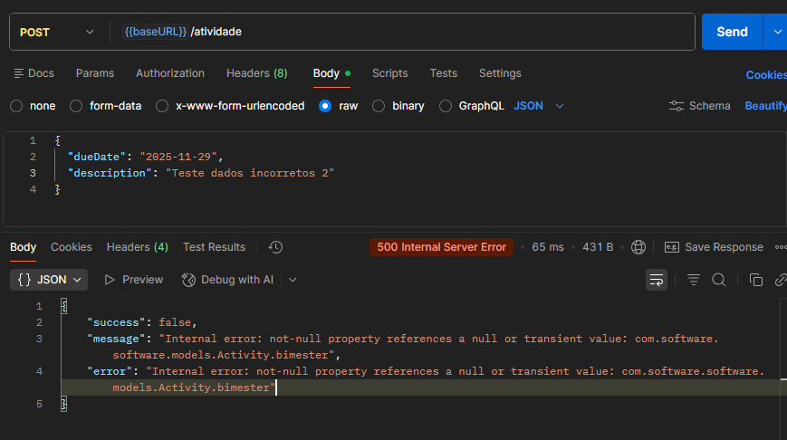

- Testar a criação de atividades com campos nulos.

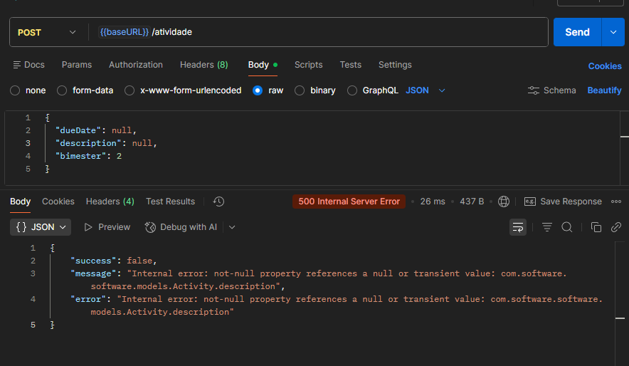

### Cenário 2: Observações (Pedro)

- **Cenário de Sucesso:** Testar o envio de uma observação válida para um aluno existente, selecionando o tipo de notificação (ex: Email ou WhatsApp). O sistema deve salvar o registro no banco e disparar a notificação.

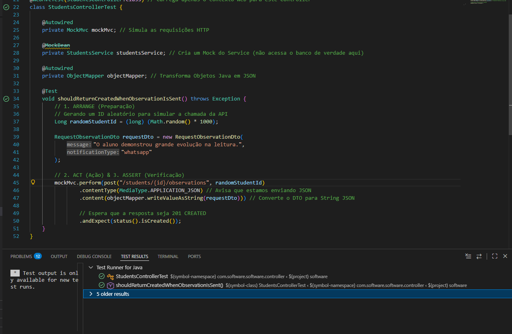

- **Cenário de Falha (Aluno Inexistente):** Testar o envio de uma observação para um ID de aluno que não existe no banco de dados. O sistema deve retornar erro 404 ou 500 (conforme tratamento de exceção).

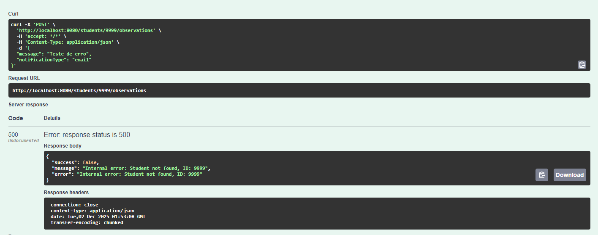

- **Cenário de Persistência:** Verificar se, após o envio, a observação foi realmente gravada na tabela `observations` com a data e hora corretas.

### Cenário 3: Registro de Aulas (Yoshida)

- **Teste 1:** Registro de aula com dados inválidos
  
Verificar como a API reage a um formato de data impossível.
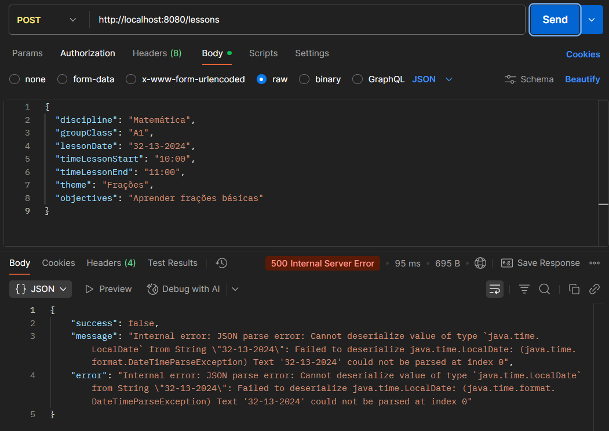

- **Teste 2:** Falta de campo obrigatório
  
Verificar se a API rejeita requisições quando falta um campo obrigatório.
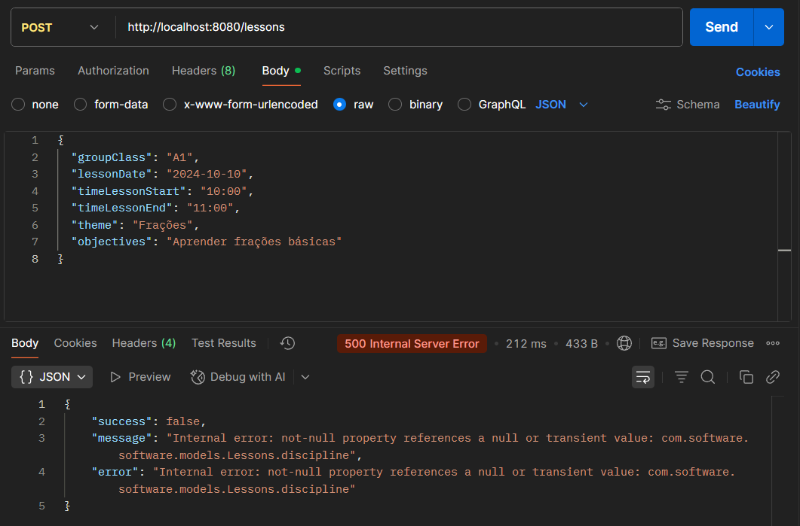

- **Teste 3:** Registro de aula com horário invertido
  
Verificar como a API trata um horário inválido, onde a aula termina antes de começar.
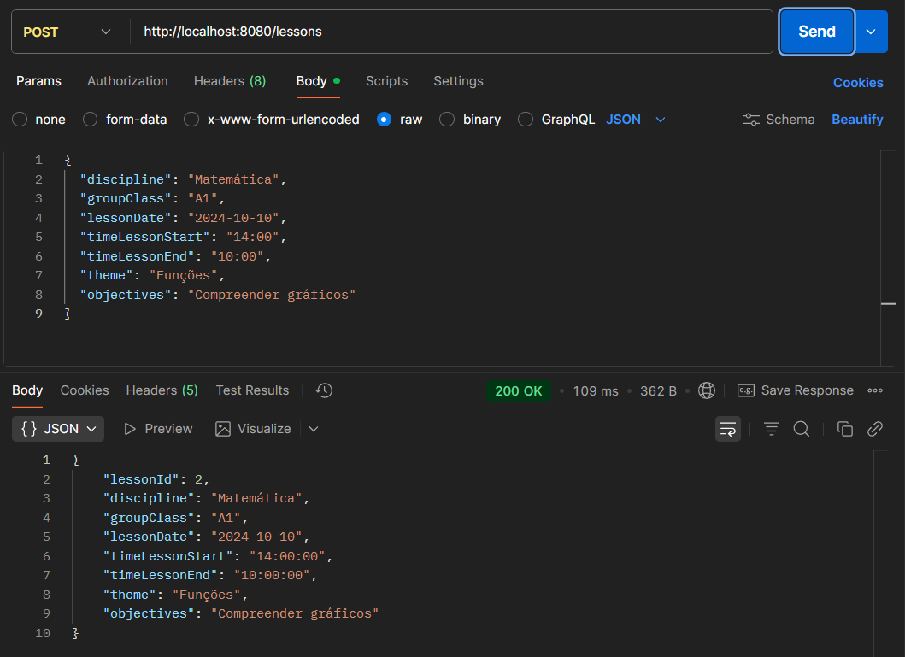
Foi possível registrar aula com horário invertido, necessário novas correções.

- **Teste 4:** Registro de aula com dados válidos
  
Confirmar que a API registra corretamente uma aula quando todos os campos obrigatórios são enviados com valores válidos.
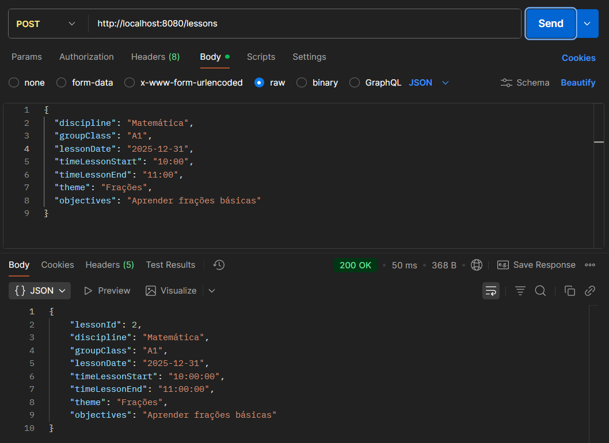

## Testes Automatizados

### Testes de Atividades (Levorato)

Para os testes automatizados, utilizamos o JUnit para garantir a funcionalidade correta do sistema de atividades. A seguir estão os casos de teste implementados:

- `postActivityWithStudentsCreatesActivitiesForAllStudents`: Testa a criação de atividades para múltiplos estudantes.
- `getAllActivitiesReturnsAllActivities`: Testa a recuperação de todas as atividades.
- `sendReminderNotificationsWithValidIdSendsNotifications`: Testa o envio de notificações de lembrete para uma atividade específica.
- `postActivityWithNoStudentsReturnsWarningMessage`: Testa a criação de uma atividade sem estudantes associados, esperando uma mensagem de erro.
- `postActivityWithNullDescriptionThrowsException`: Testa a criação de uma atividade com descrição nula, esperando uma exceção.
- `postActivityWithPastDueDateThrowsException`: Testa a criação de uma atividade com data de vencimento no passado, esperando uma exceção.
- `sendReminderNotificationsWithInvalidIdThrowsException`: Testa o envio de notificações de lembrete para uma atividade com ID inválido, esperando uma exceção.
- `sendReminderNotificationsWithNullIdThrowsException`: Testa o envio de notificações de lembrete para uma atividade com ID nulo, esperando uma exceção.

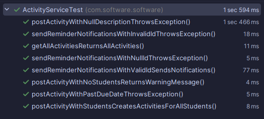

### Testes de Observações (Pedro)

Para garantir a qualidade e a confiabilidade da nova funcionalidade de Observações, foi aplicada a metodologia **TDD (Test Driven Development)**. Primeiro foram criados os testes que falhavam (Red), depois a implementação (Green) e por fim a refatoração.

**Testes Unitários (`StudentsServiceTest`):**
Utilizando JUnit e Mockito para isolar a regra de negócios.
- `shouldCreateObservationAndNotifyParent`: Verifica o fluxo principal.
  - Simula um aluno existente.
  - Valida se o método `save` do `ObservationRepository` foi chamado (Persistência).
  - Valida se a `NotificationServiceFactory` foi acionada para criar o serviço de notificação correto (Email/SMS).
  - Valida se o método `sendNotification` foi executado com o email do responsável.

**Testes de Integração (`StudentsControllerTest`):**
Utilizando `MockMvc` para testar a API REST.
- `shouldReturnCreatedWhenObservationIsSent`: Realiza uma requisição HTTP `POST` simulada para o endpoint `/students/{id}/observations`.
  - Envia um JSON com a mensagem e o tipo de notificação.
  - Verifica se a API retorna o status HTTP **201 Created**.

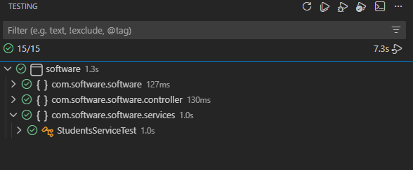

### Testes de Registros de Aula (Yoshida)

Conjunto de testes unitários para validar a criação, leitura e as validações de conflito de horários na camada de serviço (LessonsService).

- `postLessonsSuccess`: Testa a criação de um registro de aula válido.
- `postLessonsRepositoryThrows`: Simula uma falha no repositório durante a persistência do resgistro.
- `postLessonsNullDtoThrowsNPE`: Testa se nenhuma chamada indevida ao repositório é realizada.
- `getLessonsByIdFound / NotFound / NullId`: Testa comportamentos de busca por ID.

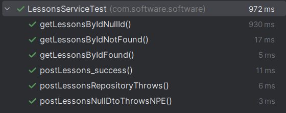

## Novas funcionalidades e refatorações

### Novas Funcionalidades (Levorato)

- Implementação do envio de notificações para uma atividade específica.

  - Endpoint: `POST /activities/{id}/send-reminders`
  - Código: [ActivityService](https://github.com/LevoratoJoao/proj-eng-software/blob/main/Trabalho2/codigo/src/main/java/com/software/software/services/ActivityService.java)

Testes realizados para garantir o funcionamento correto da funcionalidade:

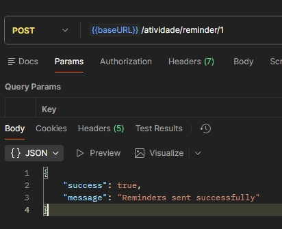
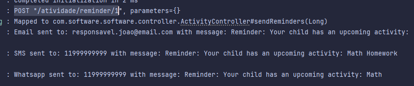

Novos testes automatizados criados para as verificações e validações da funcionalidade:

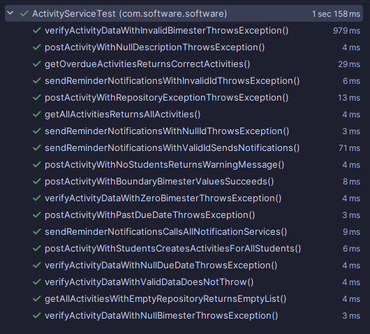

[Código dos testes](https://github.com/LevoratoJoao/proj-eng-software/blob/main/Trabalho2/codigo/src/test/java/com/software/software/ActivityServiceTest.java)

### Refatorações e correções de bugs (Levorato)

- Criação de uma classe nova para responses da API melhorando mensagens de erro e sucesso.
  - Código: [ApiResponse](https://github.com/LevoratoJoao/proj-eng-software/blob/main/Trabalho2/codigo/src/main/java/com/software/software/controller/dtos/ApiResponse.java)
- Criação de uma classe de exceções customizadas para melhorar o tratamento de erros.
  - Código: [Custom Exceptions](https://github.com/LevoratoJoao/proj-eng-software/blob/main/Trabalho2/codigo/src/main/java/com/software/software/exceptions/GlobalExceptionHandler.java)
- Refactor no método de criação de atividades para melhorar respostas e tratamento de erros como bimestres negativos.
  - Código: [ActivityService](https://github.com/LevoratoJoao/proj-eng-software/blob/main/Trabalho2/codigo/src/main/java/com/software/software/services/ActivityService.java)
- Criação de constantes para mensagens de erro e sucesso melhorando manutenção e legibilidade do código.

### Novas Funcionalidades (Pedro)

- **Envio e Persistência de Observações Pedagógicas**
  - Funcionalidade desenvolvida seguindo estritamente o ciclo de **TDD**.
  - Permite que o professor registre uma observação sobre o aluno e notifique os pais automaticamente.
  - Diferente da versão anterior, agora as observações ficam salvas no histórico do aluno (Banco de Dados).
  - **Endpoint:** `POST /students/{id}/observations`
  - **Código:** [StudentsService.java](https://github.com/LevoratoJoao/proj-eng-software/blob/main/Trabalho2/codigo/src/main/java/com/software/software/services/StudentsService.java) e [StudentsController.java](https://github.com/LevoratoJoao/proj-eng-software/blob/main/Trabalho2/codigo/src/main/java/com/software/software/controller/StudentsController.java)

**Evidência de TDD e Testes:**
Foram criados testes automatizados que cobrem tanto a lógica de serviço quanto a camada de controle.
- Código dos Testes: [StudentsServiceTest.java](https://github.com/LevoratoJoao/proj-eng-software/blob/main/Trabalho2/codigo/src/test/java/com/software/software/services/StudentsServiceTest.java)

### Refatorações e correções de bugs (Pedro)

- **Padronização de DTOs:**
  - Criação do pacote `dtos/observation` e implementação do `RequestObservationDto` utilizando Java Records para imutabilidade e código mais limpo, substituindo implementações antigas despadronizadas.
- **Injeção de Dependência e Arquitetura:**
  - Refatoração do `StudentsService` para incluir a injeção do `ObservationRepository` e da `NotificationServiceFactory`, permitindo o desacoplamento entre a lógica de salvar dados e a lógica de enviar notificações.
- **Estrutura de Testes:**
  - Correção da estrutura de pastas dentro de `src/test/java`, movendo os testes para os pacotes espelhados corretamente (`services`, `controller`), garantindo que o Maven/Gradle reconheça e execute os testes automatizados durante o build.
 
### Novas Funcionalidades (Yoshida)

- Garantir integridade da agenda evitando registros de aulas sobrepostas por turma.
- Código: [LessonsService](https://github.com/LevoratoJoao/proj-eng-software/blob/main/Trabalho2/codigo/src/main/java/com/software/software/services/LessonsService.java)

Testes realizados para garantir o funcionamento correto da funcionalidade:
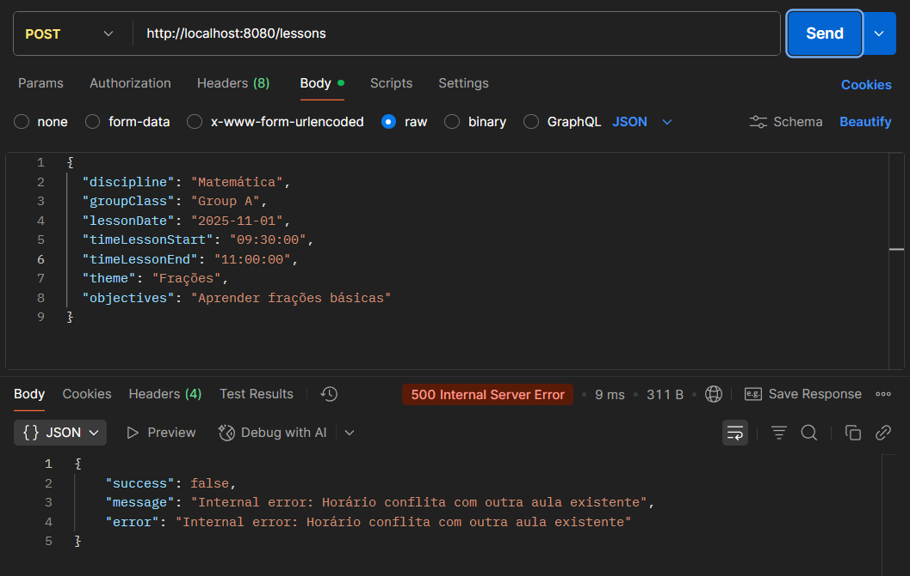

Novos testes automatizados criados para as verificações e validações da funcionalidade:
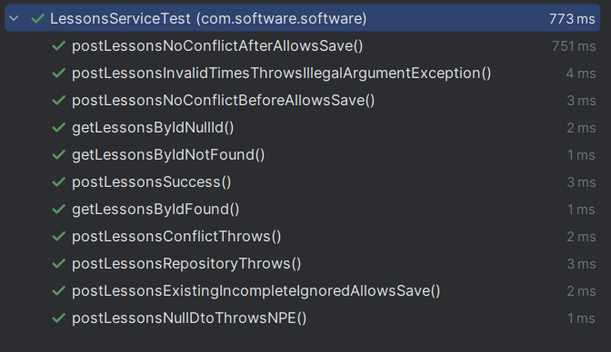

### Refatorações e correções de bugs (Yoshida)

- **Refatoração de código:**
  - O `ServiceLessons` passou por melhorias estruturais que aumentam sua robustez e clareza.
  - Código: [LessonsService](https://github.com/LevoratoJoao/proj-eng-software/blob/main/Trabalho2/codigo/src/main/java/com/software/software/services/LessonsService.java)
    
- **Tratamento de erros:**
  - O sistema valida a consistência dos horários, impedindo o cadastro de uma lição cujo horário de término seja anterior ao horário de início.
  - Código: [LessonsService](https://github.com/LevoratoJoao/proj-eng-software/blob/main/Trabalho2/codigo/src/main/java/com/software/software/services/LessonsService.java)
  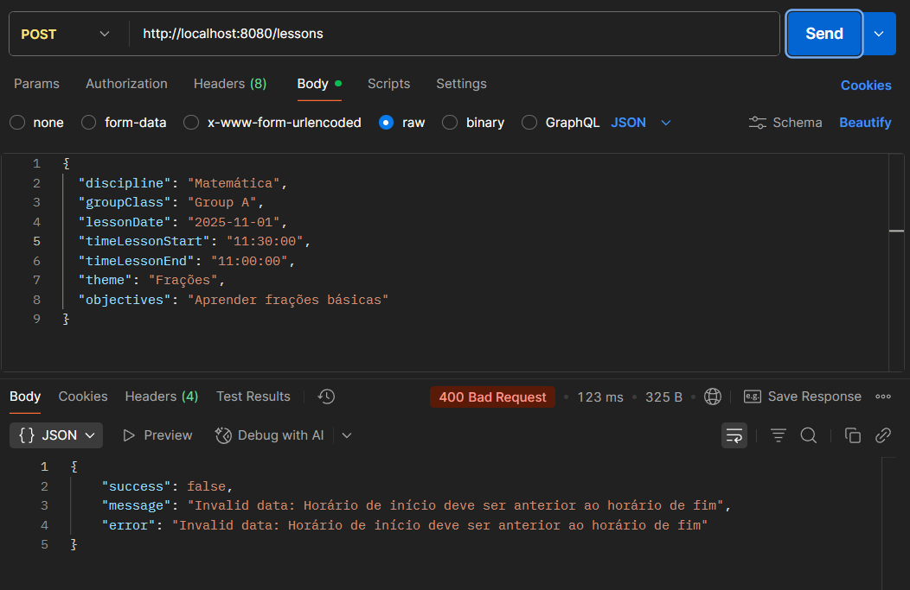

## Demonstração

[Slide](https://www.canva.com/design/DAG3BlAkJfg/NuW4hy0TVdLkqUESelTdlg/view?utm_content=DAG3BlAkJfg&utm_campaign=designshare&utm_medium=link2&utm_source=uniquelinks&utlId=h2bd91cac84)
